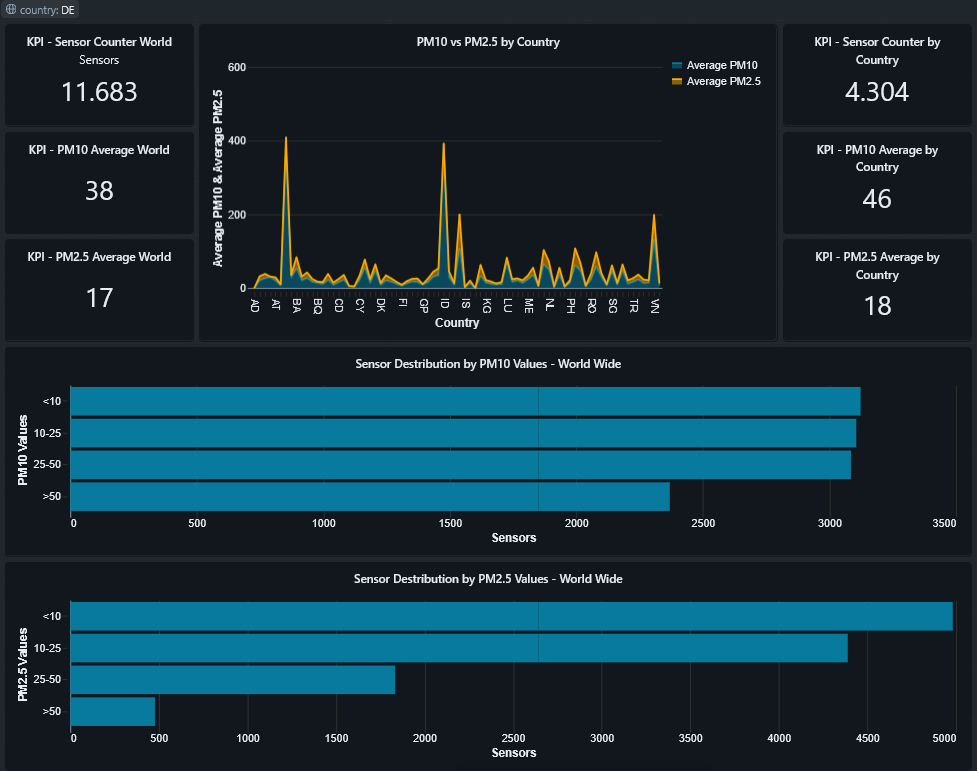

# 🌍 Real-Time Air Quality Data Pipeline (Databricks • Delta Lake • PySpark)

## Overview

This project implements a **production-style data engineering pipeline** that ingests live air-quality sensor data, validates and cleans it through layered transformations, and exposes analytics-ready datasets for **Python analysis and dashboard visualization**.

The pipeline follows a **Bronze → Silver → Gold** architecture using **Databricks, Delta Lake, and PySpark**, with a strong focus on:
* Data quality and physical plausibility
* Deterministic deduplication
* Analytics-friendly modeling
* Dashboard-ready aggregation

The final outputs power both:
* Python-based exploratory analysis
* Databricks SQL dashboards for air-quality monitoring

---

## Architecture Overview



---

## Data Source

* **sensor.community**
* Public, community-driven air-quality sensor network
* Live PM10 (P1) and PM2.5 (P2) measurements

**API endpoint:**
[https://data.sensor.community/static/v2/data.json](https://data.sensor.community/static/v2/data.json)

---

## Project Structure

```text
air-quality-databricks-pipeline
├── docs
│   ├── architecture.png
│   ├── data-model.md
│   └── project-overview.md
│
├── notebooks
│   ├── 00_run_pipeline             # Pipeline orchestration notebook
│   ├── 01_platform_bootstrap       # Database and environment setup
│   ├── 02_bronze_ingest_live       # Bronze ingestion (raw JSON)
│   ├── 03_silver_cleaning          # Silver cleaning & validation
│   ├── 04_gold_analytics           # Gold aggregations & snapshots
│   └── 05_gold_quality_checks      # Gold-layer quality & sanity checks
│
├── src
│   └── utils
│       ├── __init__.py             # Utility package initializer
│       ├── bronze.py               # Bronze preparation helpers
│       └── http.py                 # API fetching logic
│
├── dashboards
│   └── databricks_sql              # Dashboard screenshots / exports
│
└── README.md
```

---

## Requirements

This project is designed to run on **Databricks** and uses **PySpark with Delta Lake**.

### Platform
* Databricks Workspace
* Databricks SQL enabled (for dashboards)
* Delta Lake support

### Databricks Runtime
* **Databricks Runtime 13.x+** (recommended)
  * Apache Spark 3.x
  * Delta Lake preinstalled

### Python Dependencies
The following Python libraries are required and available by default on Databricks:

* `pyspark`
* `requests`
* `json`
* `uuid`
* `datetime`

No external package installation is required.

### Data Access
* Public API access to:
  * `https://data.sensor.community/static/v2/data.json`
* No authentication required

---

## How to Run the Project

The pipeline is designed to be run **end-to-end** or **step-by-step** inside Databricks.

### 1. Import the Repository
* Clone or import this repository into **Databricks Repos**
* Ensure the repository root is the working directory

---

### 2. Verify Runtime & Cluster
* Attach notebooks to a Databricks cluster running:
  * Databricks Runtime 13.x or newer
* Ensure Delta Lake is enabled (default)

---

### 3. Run the Full Pipeline (Recommended)

The project includes a dedicated **pipeline runner notebook** that orchestrates all pipeline steps.

**Runner Notebook:** `00_run_pipeline`

---

## Bronze Layer – Raw Ingestion

**Notebook:** `02_bronze_ingest_live`

### Responsibilities
* Fetch live sensor data from the API
* Store **unmodified JSON payloads**
* Append-only ingestion (ELT pattern)

### Bronze Table
**Table:** `air_quality_bronze.live_sensor_raw`

### Key Design Choices
* Raw JSON preserved for traceability
* Batch ID per ingestion run
* UTC ingestion timestamps
* No transformations or filtering

---

## Silver Layer – Cleaning & Validation

**Notebook:** `03_silver_cleaning`

### Responsibilities
* Parse raw JSON into structured schema
* Enforce data types
* Deterministic deduplication
* Physical plausibility validation
* Preserve invalid data with quality flags

### Silver Table
**Table:** `air_quality_silver.sensor_measurements`

### Transformations & Rules

#### Deduplication
* One row per `(sensor_id, timestamp, measurement_type)`.
* Keep **latest ingested record**.

#### Data Quality & Plausibility

| Rule                  | Description                                 |
|-----------------------|---------------------------------------------|
| Non-negative values   | PM values ≥ 0                               |
| PM2.5 ≤ 1.2 × PM10    | Physical plausibility                       |
| Maximum bounds        | PM10 ≤ 1000 µg/m³, PM2.5 ≤ 500 µg/m³        |

#### Quality Metadata
```text
quality_flag   → OK / BAD
quality_reason → NEGATIVE_VALUE | PM_RATIO_VIOLATION | OUT_OF_RANGE | OK
```

---

## Gold Layer – Analytics & Aggregation

**Notebook:** `04_gold_analytics`

The Gold layer provides **analytics-ready datasets** derived from validated Silver measurements.  
Only **physically plausible measurements** (`quality_flag = 'OK'`) are consumed.

Gold tables are designed for:
* Python-based analytics
* Databricks SQL dashboards
* KPI-style reporting

---

### Gold Table: Daily Air Quality

**Table:** `air_quality_gold.daily_air_quality`

**Grain:**  
`(date, location_id)`

### Purpose
* Daily trend analysis
* Location-level air-quality monitoring
* Python analytics and sanity checks

### Metrics
* `pm10_avg` – Daily average PM10
* `pm25_avg` – Daily average PM2.5
* `pm10_count` – Number of PM10 measurements
* `pm25_count` – Number of PM2.5 measurements
* `sensors` – Distinct active sensors
* `measurements` – Total valid PM records

### Design Notes
* Only `quality_flag = 'OK'` records are included
* Days with no valid PM measurements are excluded
* Latitude and longitude retained for geospatial use

---

### Gold Table: Latest Sensor Snapshot

**Table:** `air_quality_gold.latest_sensor_snapshot`

**Grain:**  
`(sensor_id)`

### Purpose
* Dashboard KPIs
* Country-level filtering
* Real-time-ish air-quality overview

### Metrics
* Latest PM10 and PM2.5 values per sensor
* Sensor metadata and location
* Ingestion timestamp
* Derived `date` column for time-based filtering

### Design Notes
* One row per sensor (latest measurement)
* Uses window functions for deterministic snapshot selection
* Optimized for Databricks SQL dashboards

---

## Dashboard & Visualization

**Platform:** Databricks SQL Dashboard

The dashboard consumes **only Gold tables**, ensuring:
* Clean, validated data
* Fast query performance
* Clear separation of concerns

### Current Dashboard Components
* **Global KPI tiles**
  * Average PM2.5
  * Average PM10
  * Active sensor count
* **PM10 vs PM2.5 comparison by country**
*  **PM2.5 distribution (bar chart)**
*  **PM10 distribution (bar chart)**
* **Global country filter**

### Dashboard Design Principles
* Aggregation logic lives in Gold, not dashboards
* Filters applied on low-cardinality dimensions (e.g. country)
* Visuals remain simple and interpretable

---

## Python Utilities & Code Organization

Reusable logic has been extracted into `src/utils` to improve:
* Code readability
* Testability
* Reusability across notebooks

### Utilities Include
* HTTP request handling
* Bronze row preparation
* Shared helper functions

### Databricks Runtime Note
To ensure utilities are available during pipeline execution, notebooks include:

```python
import sys, os
sys.path.append(os.path.abspath(".."))
```

---

## Data License & Attribution

This project consumes public air-quality data provided by **sensor.community**.

**Data source:**
- sensor.community
- https://sensor.community

**License:**
- Creative Commons Attribution 4.0 International (CC BY 4.0)

The data is used in compliance with the license terms.
All transformations and aggregations are derived works.

## Acknowledgements

This project is built and executed using the following technologies:

- **Databricks Free Edition** (Apache Spark–based analytics platform)
- **Apache Spark** (distributed data processing engine)
- **Delta Lake** (ACID storage layer for big data)

All trademarks and registered trademarks are the property of their respective owners.

---

## Future Improvements

Planned enhancements for this project include:

* **Dashboard Screenshots:**  
  Add visual examples of Databricks SQL dashboards to the documentation for easier onboarding and demonstration.

* **Advanced Dashboard Analytics:**  
  Implement more complex analytics in dashboards, such as time-series anomaly detection, sensor reliability scoring, and geospatial heatmaps.

* **Automated Data Quality Monitoring:**  
  Integrate automated alerts and monitoring for data quality issues, enabling proactive detection of sensor anomalies and pipeline failures.

If you have other ideas or feature requests, feel free to contribute or open an issue!

